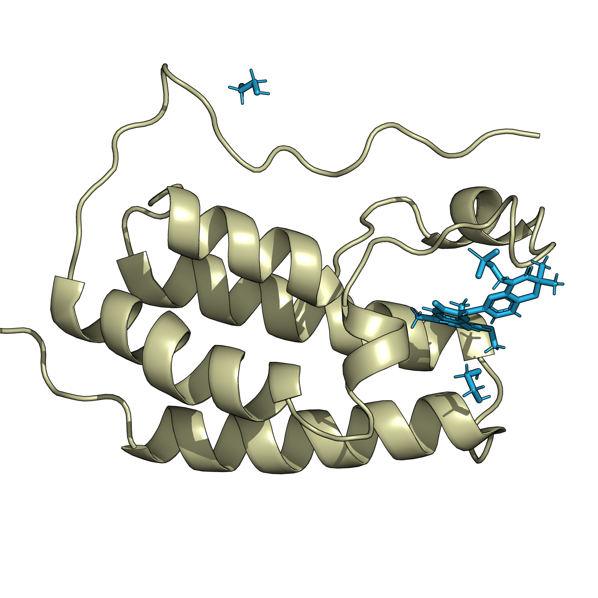
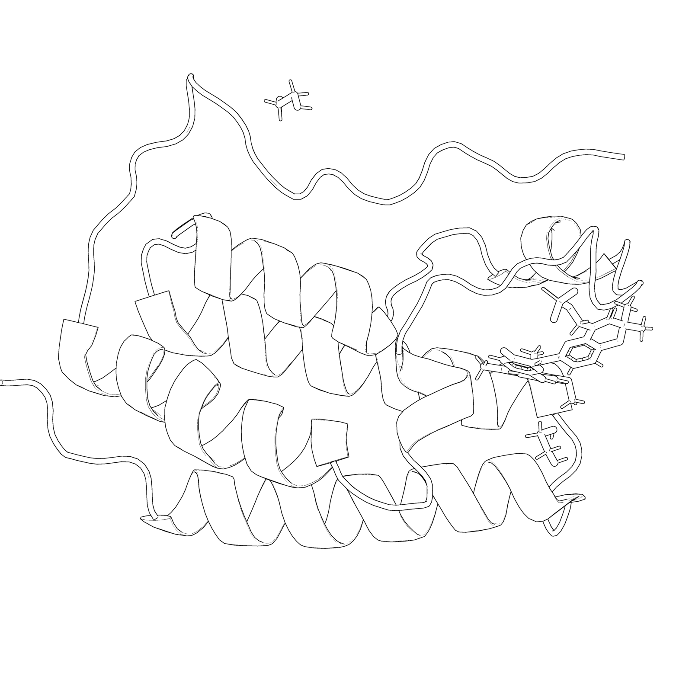
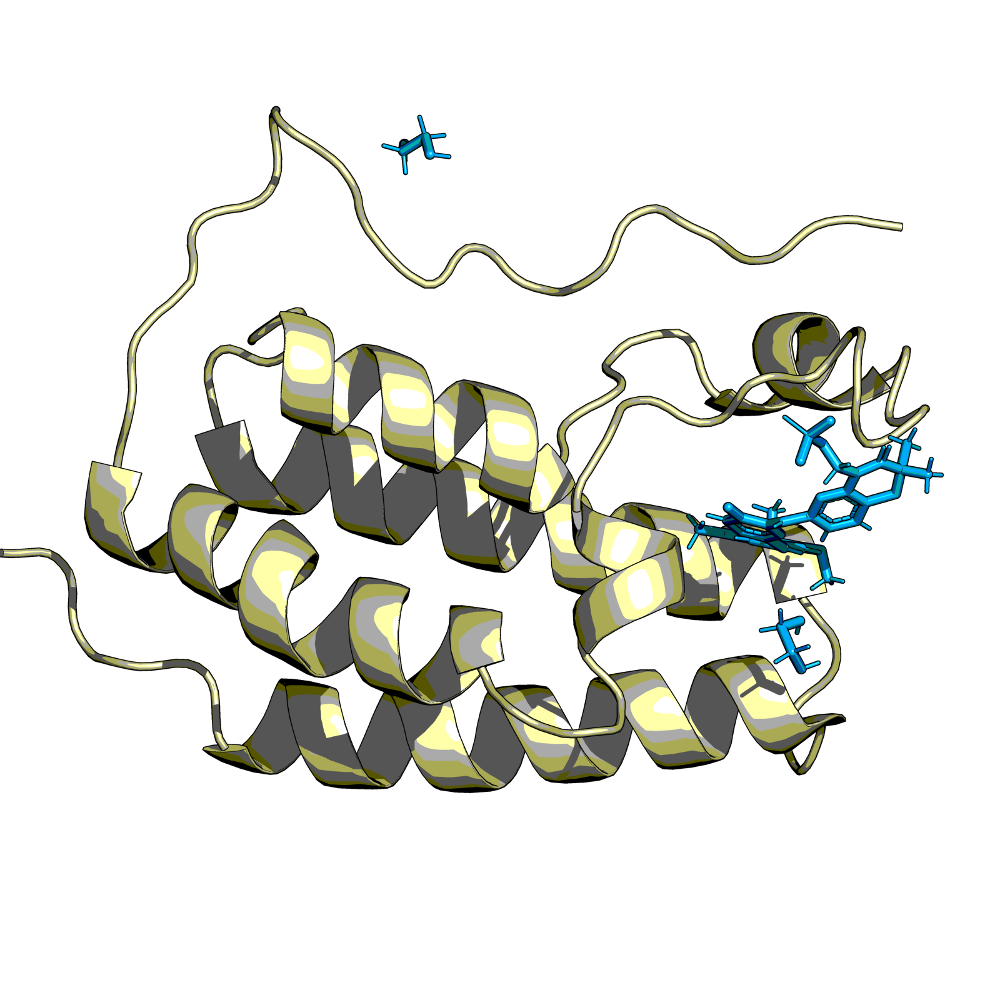
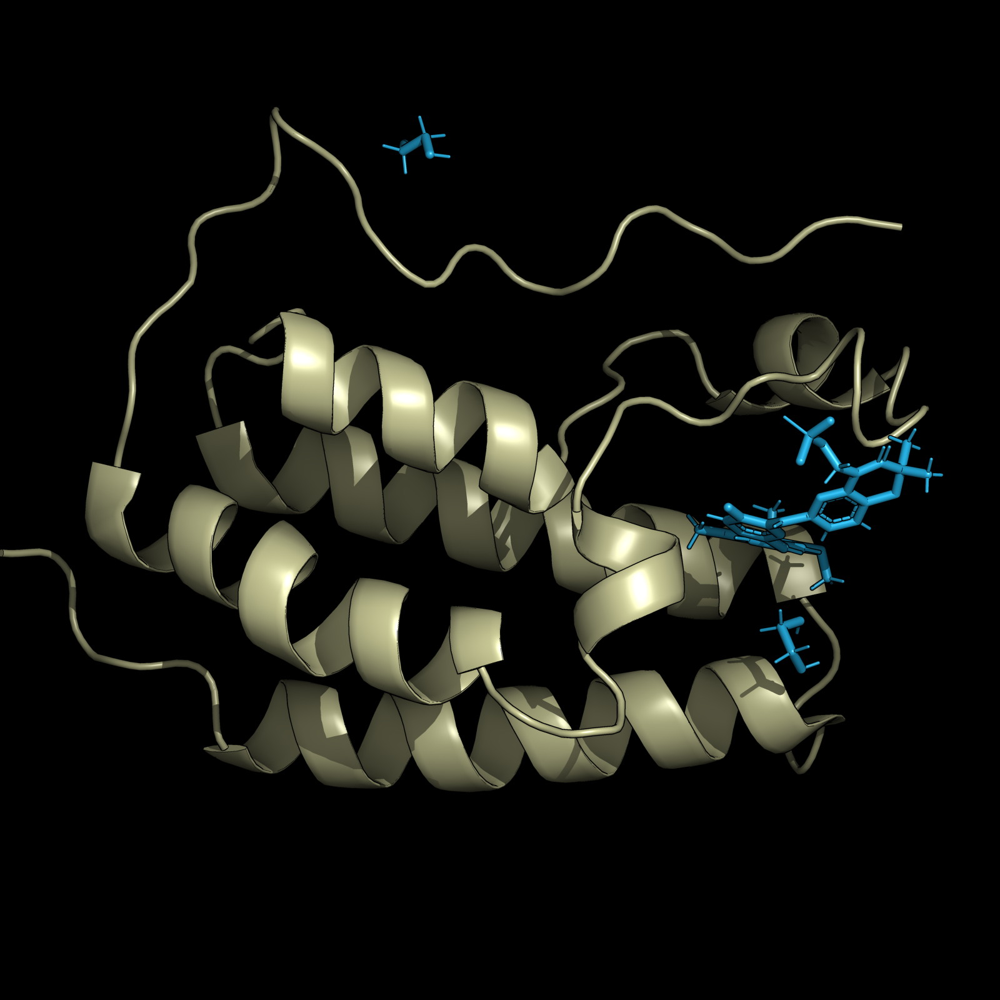
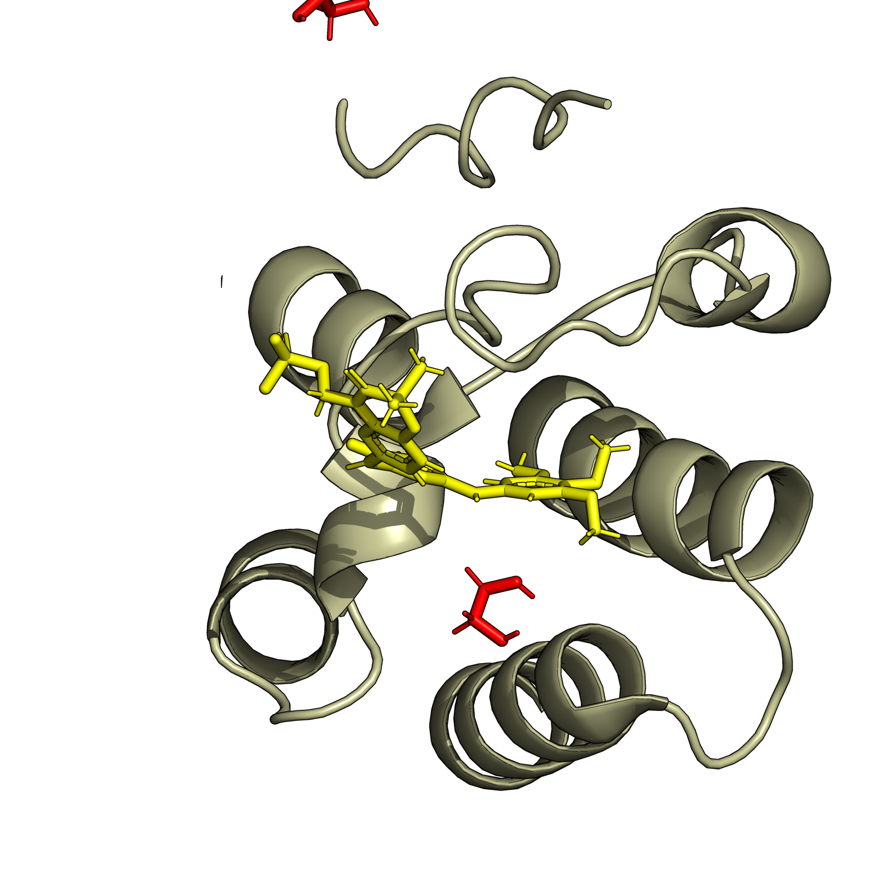

# Create an image of a PDB file

One dependency:
```
mamba install -c conda-forge pymol-open-source
```

## Examples

### Get PDB file:
```
curl -O https://files.rcsb.org/download/4O75.pdb
```

### Images:
```
python pdb2png.py 4O75.pdb
```


```
python pdb2png.py 4O75.pdb --render_style default_bw
```


```
python pdb2png.py 4O75.pdb --render_style default_cartoon
```


```
python pdb2png.py 4O75.pdb --render_style dark
```


```
python pdb2png.py 4O75.pdb --hetatm_color red --ligand_id 2RC --ligand_color 1,1,0 --protein_rotate 0,-70,0 --render_style default
```

